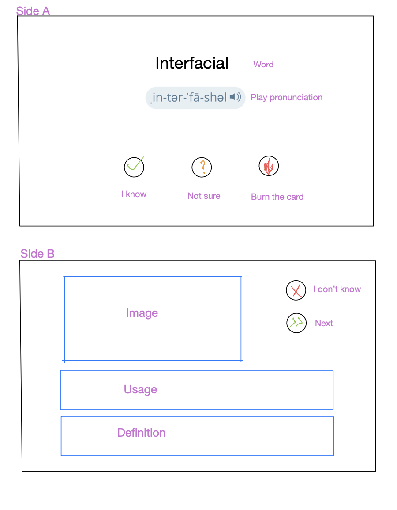
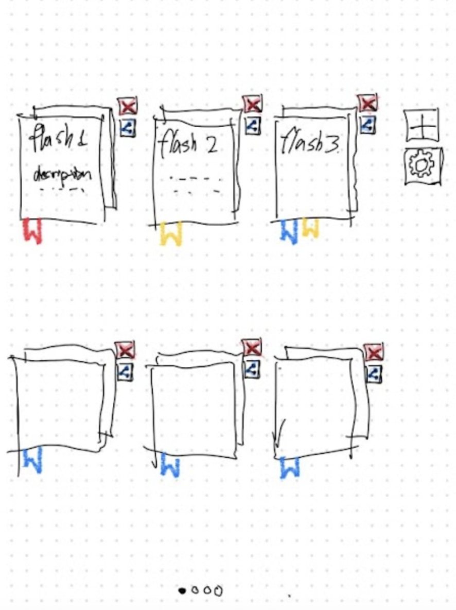
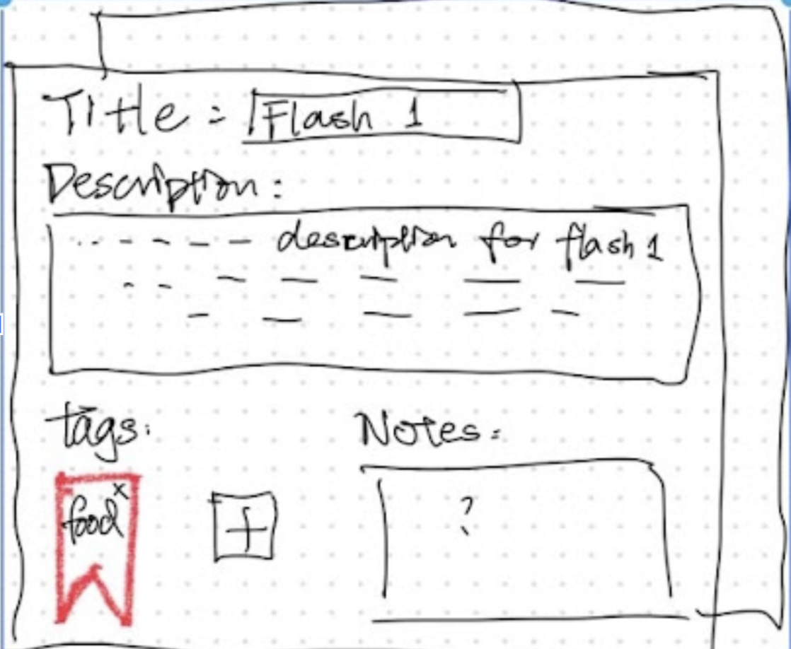

# LexiBoost
- [LexiBoost](#lexiboost)
  - [Introduction](#Introuction)
  - [Description](#description)
  - [Requirements](#requirements)
    - [Minimal Requirements:](#minimal-requirements)
    - [Standard Requirements:](#standard-requirements)
    - [Stretch Requirements:](#stretch-requirements)
  - [Task Breakdown](#task-breakdown)
  - [Prototype](#prototype)
    - [Flashcard Learning](#flashcard-learning)
    - [Bookshelf](#bookshelf)
    - [Note and Tags Editor](#note-and-tags-editor)

## Introduction
Welcome to LexiBoost, an AI-powered flashcard app for accelerated learning! In addition to making flashcards in the old-fashioned way, you can use AI technology to effortlessly populate flashcards decks at a single click. Keep your learning journey on track with our progress tracking feature, while also exploring a vibrant marketplace where you can publish your own decks as well as import ones from other users, fostering a friendly and collaborative learning community!

## Description
LexiBoost is a language learning platform designed for individuals looking to enhance their vocabulary skills. Users can use flashcards to learn and review vocabulary. It stores data such as user account information, flashcard decks, learning progress, and subscription details. Users will use these data to create accounts, access flashcard decks, track their learning progress, and personalize their desk libraries. Additional functionality that can be considered based on time constraints includes social features like user ratings and comments on flashcard decks, chat functionality for users to interact, and AI-powered deck creation based on user preferences and learning goals.

## Requirements

### Minimal Requirements: 
* As a user I want to be able to sign up, so I can access the application .
* As a user, I want to be able to login so that I can access my own data stored in the application.
* As a user, I want to be able to browse through available decks, so I can choose my deck.
* As a user, I want to be able to keep(import) the interesting decks, so that I can view them later .
* As a user I want to be able to view my personal decks, so I can choose what decks to study.
* As a user I want to be able to view cards in a deck, so I can revise them.

### Standard Requirements: 
* As a user I want to be able to delete cards from my personal deck, so that my deck is never overly bulky
As a user I want to be able to add new cards to a deck in my personal decks, so that I can address and practice new vocabulary.
* As a user, I want to be able to create a new deck of flashcards, so that I can study a topic of my own interest.
* As a user, I want to have the ability to mark flashcards as "mastered" or "needs review" to track my progress, so that I can focus on words that I’m least familiar with
* As a user, I want to have the option to share my decks with other users, so that users can access decks of new topics and different focuses.
* As a user, I want to be able to shuffle the order of flashcards within a deck, so that I do not suffer from sequential effects caused by decks of the same order.
* As a user, I want to be able to set reminders or notifications to study my flashcards at specific times or intervals, so I can keep a vigorous study schedule. 

### Stretch Requirements: 
* As a user, I want to be able to purchase premium plans, so that I can gain access to more specially designed decks.
* As a user, I want to be able to use large language models to generate new card decks for me based on topics, so that I can skip the process of generating/finding decks myself.
* As a user, I want to be able to see my progress visualized, so that I can get a more intuitive and colorful view of my study progress.
* As a user, I want to review my flashcards with sounds, so that I can practice pronunciations of vocabulary.
* As a user, I want to add pictures to decks as covers, so that the decks are more visually appealing and distinguishable.

## Task Breakdown

* As a user I want to be able to sign up for the application:
    1. Collect the user’s account information:
        * Description: We need a component providing users with Google sign up.
        * DOD: 
            * The user can access the sign up service provided by Google oAuth through the sign up page.
            * After signing up, the user is redirected back to the webpage.

    2. Initialize the database:
        * Description: In order to be able to store collections in MongoDB, we need to create our initial database schema. Therefore, we need to create collections in order to add/retrieve documents from it.
        * DOD: 
            * We'll create a  MongoDB account.
            * The user’s information is stored in the database.
            * We can connect DB to our server
            * We'll write scripts that would initialize our collections. 
    3. Create a user account:
            * Description: In order to be able to sign up a user, we need to add them to our User collection. Create a POST endpoint to be able to add a user. 
            * Endpoint: `/api/users`
            * Request body:
            `{ "googleId": "1234567890", "email": "user@example.com", "name": "John Doe",}`
            * DOD: 
                * We can call the end point using post man 
                * A new user document will be added to to the collection 
                * The endpoint returns appropriate status codes (2XX, 4XX, 5XX) for each scenario it’s called in. 
  
* As a user, I want to be able to browse through available decks:
    1. Get Decks from marketplace
       * Description: In order to be able to view the decks we need to implement a GET endpoint that gets us all available decks. 
       * Endpoint: `/api/decks`
       * Request body: `{"userID": "1234567890",}` 
       * DOD: 
            * Return a list of all decks. 
            * The endpoint returns appropriate status codes (2XX, 4XX, 5XX) for each scenario it’s called in. 
    2. Show decks in a page:
        * Description: Design and implement a page where users can view and choose decks to add to their personal collection.
        * DOD: 
            * Design an intuitive and visually appealing Deck Selection page.
            * Display available decks with relevant information.
            * Implement search and filter functionality for easy deck discovery.
            * Enable users to add or remove decks from their personal collection.
            * Ensure responsive design for seamless experience on different devices.

## Prototype

### Flashcard Learning

### Bookshelf

### Note and Tags Editor

